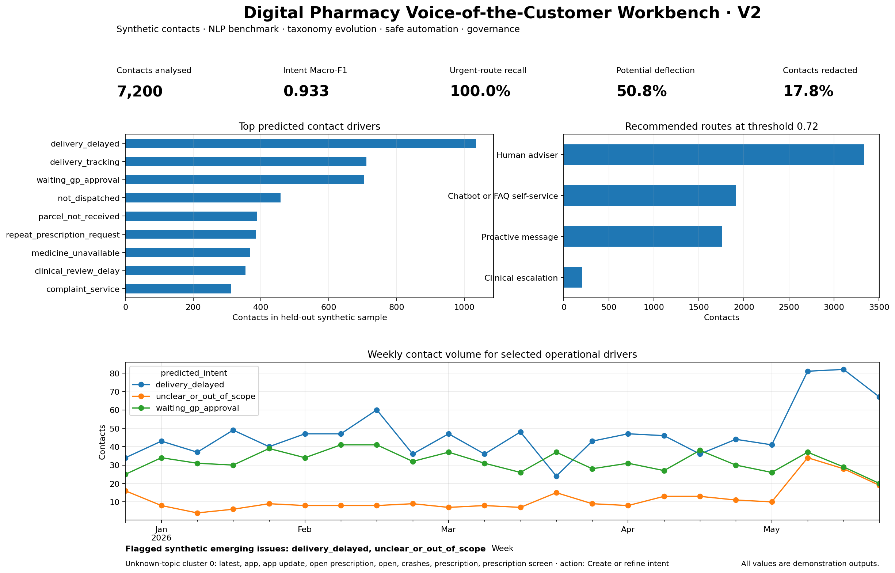

# Digital Pharmacy Voice-of-the-Customer Intelligence, Taxonomy Evolution and Safe Automation Workbench

A portfolio project for a **Customer Insight Data Scientist** role in digital healthcare. The V2.1 repository turns noisy multi-channel customer text into contact-driver insight, safe routing recommendations, new-topic review queues, synthetic CRM outcome analysis, and a ten-page Streamlit dashboard.

> **Important:** every contact and CRM record in this repository is synthetic. This is not a Pharmacy2U internal system. It contains no patient records and no company operational metrics.



## What V2 demonstrates

- A reproducible pipeline for 30,000 synthetic phone transcripts, emails, live chats, app reviews, and social contacts.
- A 22-intent digital-pharmacy taxonomy for prescription requests, GP approval, clinical review, dispensing, dispatch, delivery, accounts, reminders, complaints, shop queries, and safety-sensitive cases.
- Local rule-based redaction for email, phone, date of birth, postcode, NHS-number-like strings, order references, named-person phrases, GP surgery phrases, and street addresses.
- Intent-classification benchmarks using word TF-IDF, character-and-word TF-IDF, and local dense latent-semantic analysis (LSA) embeddings.
- An independently evaluated sentiment-classification model rather than a dashboard field copied from the synthetic generator.
- Confidence monitoring, a reliability diagram, Expected Calibration Error (ECE), a coverage–accuracy curve, per-channel metrics, and a temporal holdout benchmark.
- Safe routing to FAQ or chatbot self-service, proactive messaging, a human adviser, or clinical escalation. Safety-sensitive language overrides automated routing.
- Emerging-issue monitoring and unknown-topic discovery for taxonomy review.
- A versioned annotation queue with review status, reviewer fields, editable labels, and CSV export.
- Synthetic CRM linkage and interpretable logistic-regression driver models for low Customer Satisfaction (CSAT) and 90-day non-retention outcomes.
- FAQ retrieval benchmarks for a lexical baseline and a local latent-semantic embedding baseline.
- Optional connected-environment scripts for Sentence Transformers classification and Hugging Face transformer fine-tuning. The packaged reports do not claim results from models that were not run.

## Packaged V2 results

The included results come from a full local rebuild. They validate pipeline behaviour on generated data; they are not production estimates.

| Check | Result |
|---|---:|
| Synthetic multi-channel contacts | 30,000 |
| Held-out intent test contacts | 7,200 |
| Packaged intent model | Character-and-word TF-IDF + linear SGD classifier |
| Held-out intent Macro-F1 | 0.933 |
| Temporal-holdout intent Macro-F1 in benchmark sample | 0.892 |
| Urgent-route recall | 100.0% |
| Low-confidence review rate at threshold 0.72 | 14.9% |
| Expected Calibration Error | 0.101 |
| Independent sentiment Macro-F1 | 0.614 |
| Contacts with at least one rule-based redaction | 17.8% |
| Total rule-based redactions | 5,810 |
| Simulated contact-deflection rate at threshold 0.72 | 50.8% |
| Low-CSAT synthetic driver model ROC-AUC | 0.698 |
| Unit tests | 13 passed |
| Streamlit page execution tests | 10 passed |

The sentiment model has weaker performance on the smallest positive-sentiment class. This is intentionally reported rather than hidden. It shows why class-level review matters before operational use.

## Synthetic validation scenarios

The generator adds controlled patterns so that the monitoring pages can be checked:

1. A recent increase in `delivery_delayed` contacts tests the known-intent trend monitor.
2. A late app-update/app-crash pattern is initially labelled `unclear_or_out_of_scope`. The taxonomy-evolution workflow identifies an unknown-topic cluster with terms such as `latest app`, `update`, and `open prescription`, then recommends creating or refining an intent.
3. Generated text includes spelling mistakes, abbreviations, partial questions, multi-intent contacts, channel-specific phrasing, and personal-data-like strings for redaction audit.

## Dashboard pages

1. Executive overview
2. Journey and root causes
3. Emerging issues
4. Taxonomy evolution
5. Contact deflection
6. Model benchmark
7. Annotation workflow
8. Satisfaction and retention drivers
9. Data quality and governance
10. Chatbot knowledge-base readiness

The portable HTML preview is available at:

```text
reports/dashboard_preview.html
```

## Run locally

```bash
python -m venv .venv
source .venv/bin/activate        # Windows: .venv\\Scripts\\activate
pip install -r requirements.txt
streamlit run app.py
```

The repository already contains generated synthetic data and fitted local models, so the dashboard opens without model training.

## Rebuild all generated outputs

```bash
make all
```

This command regenerates synthetic records, trains the models, writes reports, rebuilds the HTML and PNG previews, and runs tests. The training workflow runs numerical stages in separate processes with conservative BLAS thread settings so that laptop rebuilds remain predictable.

## Optional connected-environment experiments

The default repository avoids external model downloads. To run a Sentence Transformers intent-classification benchmark:

```bash
pip install -r requirements-optional-transformers.txt
python -m src.optional_transformer_benchmark \
  --input data/synthetic_contacts_raw.csv \
  --model-name all-MiniLM-L6-v2
```

To run the Hugging Face fine-tuning entry point:

```bash
python -m src.optional_hf_finetune \
  --input data/synthetic_contacts_raw.csv \
  --checkpoint distilbert-base-uncased \
  --epochs 1
```

These optional scripts need a connected environment and downloaded checkpoints. Their metrics should only be added to the report after execution.

For a production-oriented redaction experiment, install:

```bash
pip install -r requirements-optional-presidio.txt
```

The included default redactor remains local and rule-based so that its behaviour is easy to audit.

## Repository structure

```text
app.py                              Streamlit dashboard with ten pages
src/generate_data.py                Synthetic contact, CRM, FAQ, and taxonomy generator
src/preprocess.py                   Text normalisation and auditable local redaction
src/governance.py                   Data-quality and redaction reports
src/train_models.py                 Isolated-stage model training and report generation
src/topic_discovery.py              Unknown-topic discovery and review summaries
src/annotation.py                   Versioned annotation-review queue
src/crm_models.py                   Synthetic CRM linkage and interpretable driver models
src/faq_retrieval.py                Lexical, local embedding, and optional transformer retrieval
src/optional_transformer_benchmark.py  Optional Sentence Transformers benchmark
src/optional_hf_finetune.py         Optional Hugging Face fine-tuning entry point
scripts/run_training_stages.sh      Memory-safe training-stage orchestrator
sql_examples.sql                    Example relational exploration queries
data/                               Generated synthetic records and review queues
models/                             Fitted local models
reports/                            Metrics, cards, previews, and audit outputs
tests/                              Unit tests
```

## Public source boundary

Public Pharmacy2U and NHS pages informed the demonstration taxonomy and FAQ wording. See `reports/source_notes.md`. Synthetic contact text, CRM outcomes, assumed contact value, and simulated deflection value are generated examples.

## Honest limits

- Synthetic labels make the reported classification metrics more favourable than an operational setting is likely to be.
- The LSA embedding baseline is a local dense-vector model, not a transformer. Transformer experiments are separate optional scripts.
- The FAQ knowledge base is deliberately small. Retrieval scores show that it needs extension before chatbot use.
- Rule-based redaction is suitable for a transparent demonstration, not a production privacy guarantee.
- CRM outcome models describe associations in synthetic data. They do not estimate causal effects.
- Safety-routing rules are a portfolio demonstration boundary, not clinical guidance.
- A live deployment would need reviewed labels, privacy and security assessment, access controls, monitoring, incident response, and human oversight.

## Streamlit Community Cloud compatibility

The packaged scikit-learn models were fitted under Python 3.13. Streamlit Community Cloud may default to Python 3.14 for a newly created app. V2.1 loads fitted models only when the interactive chatbot page is opened. If a packaged `joblib` artefact is not portable in the selected cloud environment, the app rebuilds lightweight chatbot models in memory from `data/annotation_seed.csv`. The stored offline benchmark outputs are not replaced. For the closest environment match, select Python 3.13 in Streamlit Cloud **Advanced settings** when creating the app.

See `reports/deployment_guide.md` and `reports/v2_1_deployment_fix.md`.
